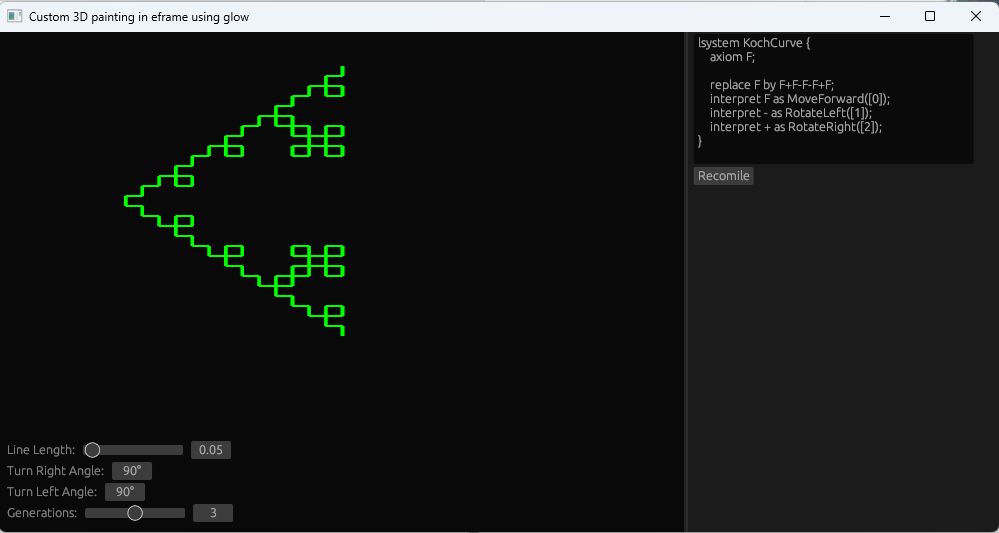

 # Stochcastic, 2-L context-sensitive, parametic, bracketed, L-System.

**Dont use yet, still in development.** 

L-Systems are a type of formal grammar that are used to generate complex structures, such as plants or trees, by iteratively replacing symbols based on rules defined by the system. L-Systems are used in fields such as computer graphics, computational biology, and artificial life to model and generate complex recursive structures.

L-systems vary in complexity were the simple version is just replacing symbols recursively but where the complex version contains logic, randomness, variables, works with context of surrounding symbols. 
This library aims to provide a simple way to build L-systems and have control the execution of the tree.

## Example

</img>

## Goal

This library will provide full support fort Stochcastic, 2-L context-sensitive, parametric, bracketed, 3d-compatible, graphical L-System. 
The goal is to make the system integrate into any graphics environment, thus the control of rendering and drawing is not included in this library.
It also provides a simple scripting language to compose your l-systems.

## Features

- [x] Basic script lexer and parser ([see reference](./script_ref.md))
- [x] parametric l-system
- [x] Bracketed l-system
- [x] Context sensitive
- [x] Stochastic Lsystem

This library already supports 100% of the [wikipedia examples](https://en.wikipedia.org/wiki/L-system). 
It still needs work on scripting abilities and more advanced l-systems with variables.

## Stochastic L-System

Stochastic L-Systems, also known as Stochastic Context-Free Grammars, are a type of L-Systems that allow for randomness in the rules used to generate the structures. In a stochastic L-System, each symbol replacement rule has a probability associated with it, determining the likelihood that the rule will be applied at each iteration. This introduces an element of randomness into the structure generation process, leading to more diverse and realistic structures, such as trees with natural variations in shape and size. 

## Bracted Systems

Bracted l-systems have symbols that defined how the tree is to be generated, allowing for the creation of hierarchical structures. 
It usually uses two symbols '[' and ']'. '[' means saving the current transform of the turtle and ']' restoring to the last saved transform. 

## Context Sensitive Systems

In a context-sensitive L-System, the rules used to generate the structure are defined based on the context of the surrounding symbols, allowing for the creation of hierarchical structures.

Left context can be used to simulate control signals that propagate acropetally from the root or basal leaves towards the apices of the modeled plant.

The right context represents signals that propagate basipetally, from the apices towards the root.

## Parametric Systems

Parametric L-systems allow for the use of variables, parameters, and functions in the rules used to generate the structures. In a parametric L-System, the rules used to generate the structure can depend on variables and parameters, allowing for greater flexibility and diversity in the structures generated. For example, parameters can be used to control the size, shape, or growth of the structures. Parametric L-Systems are used in fields such as computer graphics, computational biology, and artificial life to model and generate complex structures with greater flexibility and diversity.

## References 

- [1] http://algorithmicbotany.org/papers/abop/abop.pdf